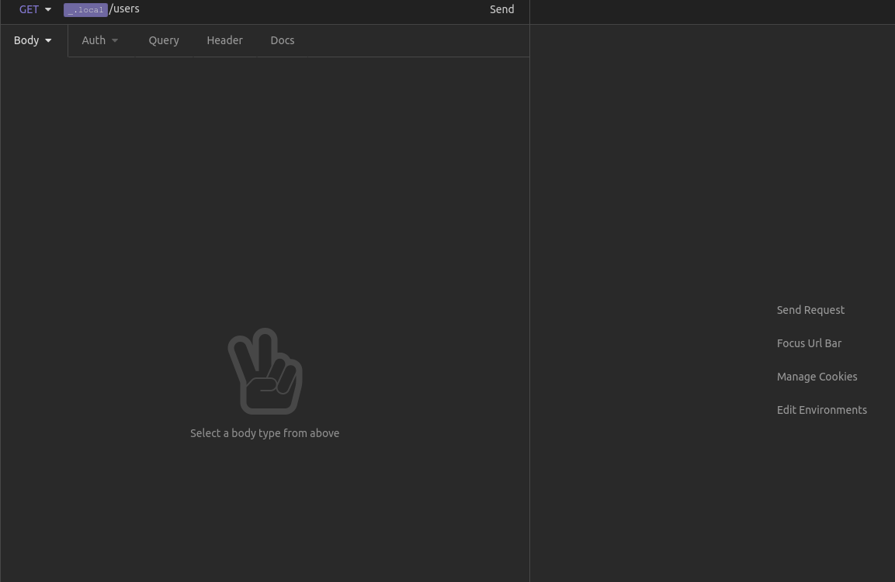
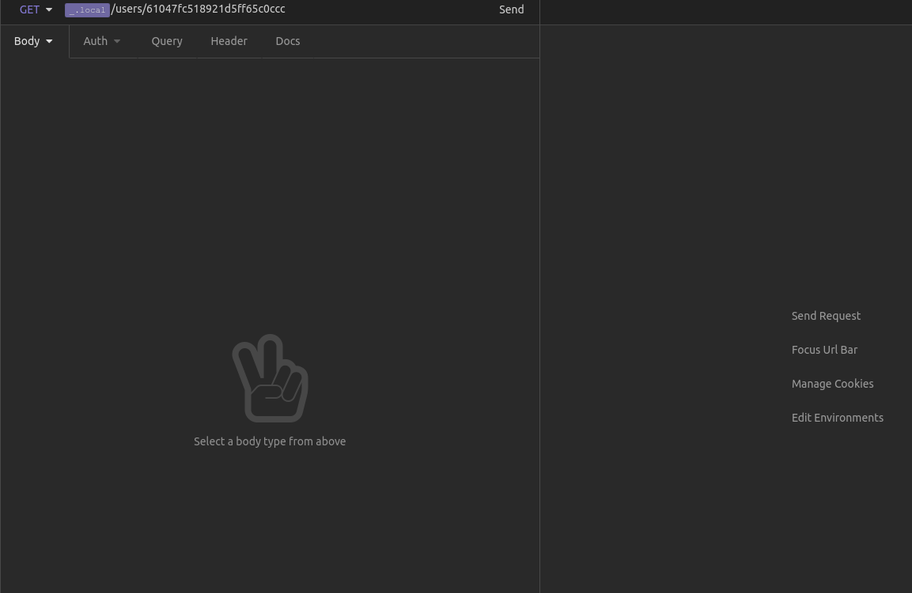
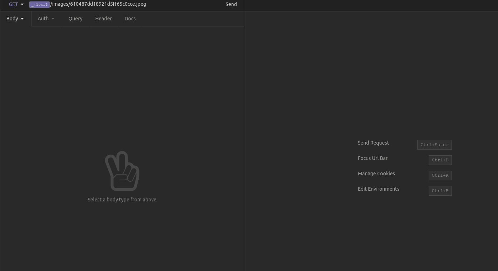
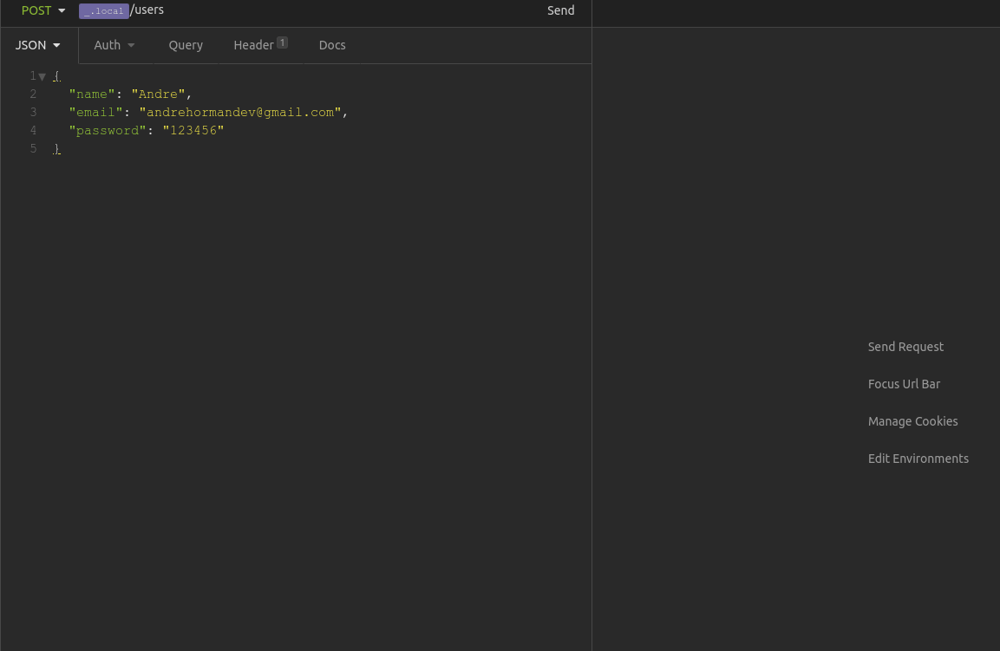
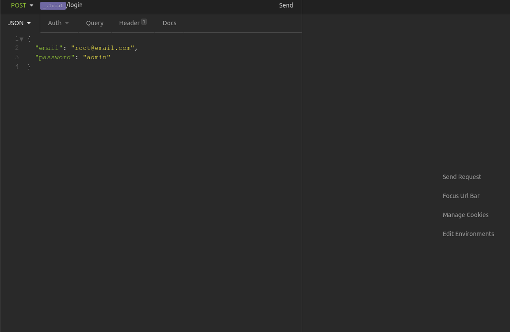
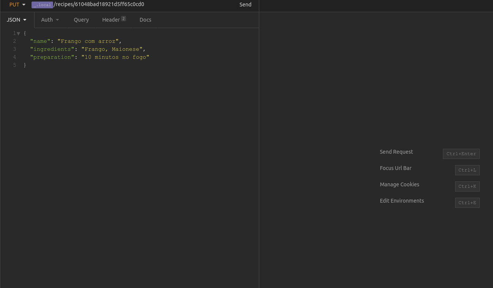
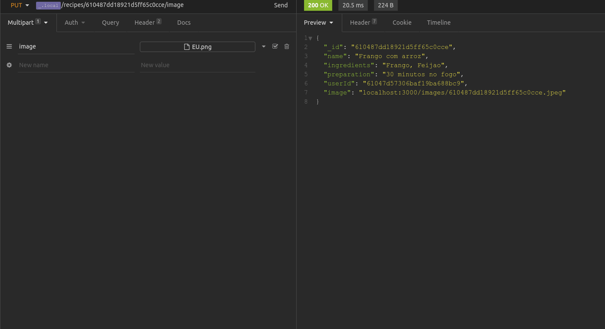
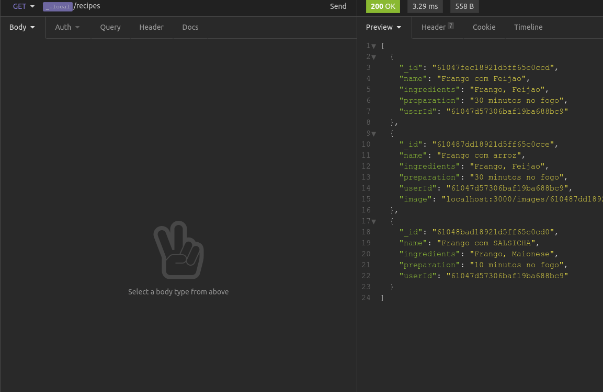

# PROJETO API COOK MASTER 👨‍🍳

- CRUD de uma API REST de Receitas, utilizando estrutura MSC (model, service e controller)

- Possível fazer o cadastro e login do usuário, apenas esse usúario poderá acessar, modificar e deletar as receitas que cadastrou.

- Desenvolvido para criar um token de autenticação, autenticar rotas do Express com o Node, usando o JWT. Dessa forma, é possível fazer o upload, salvar e consultar arquivos no servidor através de uma API REST.
    

# ROTAS E ENDPOINTS

### EXIBIR TODOS OS USUÁRIOS

  

**`VERBO: GET | ROTA: http://localhost:3000/users`**
  

---

### EXIBIR USUÁRIO PELO ID

  

**`VERBO: GET | ROTA: http://localhost:3000/users/:idUser`**
  

---

### EXIBIR TODAS RECEITAS

  

**`VERBO: GET | ROTA: http://localhost:3000/recipes`**
  

---

### EXIBIR IMAGEM DA RECEITA

  

**`VERBO: GET | ROTA: http://localhost:3000/images/:idImage`**
  

---

### CRIAR UM USUÁRIO PARA CLIENTE E ADMIN

  

**`VERBO: POST | ROTA: http://localhost:3000/user`**
  

**`VERBO: POST | ROTA: http://localhost:3000/users/admin`**
  

---

### CRIAR UMA RECEITA

  

**`VERBO: POST | ROTA: http://localhost:3000/recipes`**
  

---

### CRIAR TOKEN DE AUTENTICAÇÃO

  

**`VERBO: POST | ROTA: http://localhost:3000/login`**
  

---

### ATUALIZAR UMA RECEITA PELO ID

  

**`VERBO: PUT | ROTA: http://localhost:3000/recipes/:idRecipe`**
  

---

### ATUALIZAR IMAGEM DE UMA RECEITA

  

**`VERBO: PUT | ROTA: http://localhost:3000/recipes/:idRecipe/image`**
  

---

### DELETAR UMA RECEITA

  

**`VERBO: DELETE | ROTA: http://localhost:3000/recipes/:idRecipe`**
  

---

# TECNOLOGIAS UTILIZADAS 💻

- **NODE**
- **NODEMON**
- **EXPRESS**
- **MONGODB**
- **JWT**
- **MULTER**
    

---

# INSTRUÇÕES IMPORTANTES 📝

## COMO BAIXAR O PROJETO:

1. Clone o repositório:
   - **`git clone git@github.com:ANDREHORMAN1994/PROJECT-28-NODE-CookMaster.git`**
2. Entre na pasta do repositório que você acabou de clonar:
   - **`cd PROJECT-28-NODE-CookMaster`**
       

## COMO RODAR O PROJETO:

1. Necessário ter o **`Node`**, **`NPM`** instalados e o servidor do **`MongoDB`** ativo:
   - Abra o terminal na raiz do Projeto
   - Rode o comando **`npm install`** para instalar as dependências
   - Rode o servidor com o comando **`npm run debug`**
   - Recomendado ter o **`Insomnia`** ou **`Postman`** para testar todas requisições
       

---

# VQV 🚀
